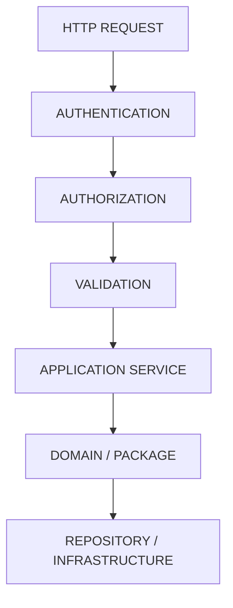

# API Architecture

The API exposes domain operations via REST.

## Request Flow

## Rules
- All protected endpoints MUST resolve `organization_id` from the session.
- API MUST enforce authentication boundaries.
- HTTP logic MUST NOT leak into domain packages.
