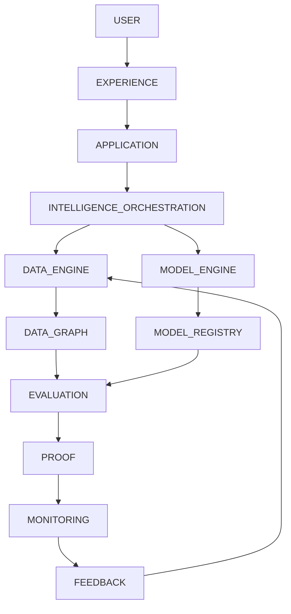
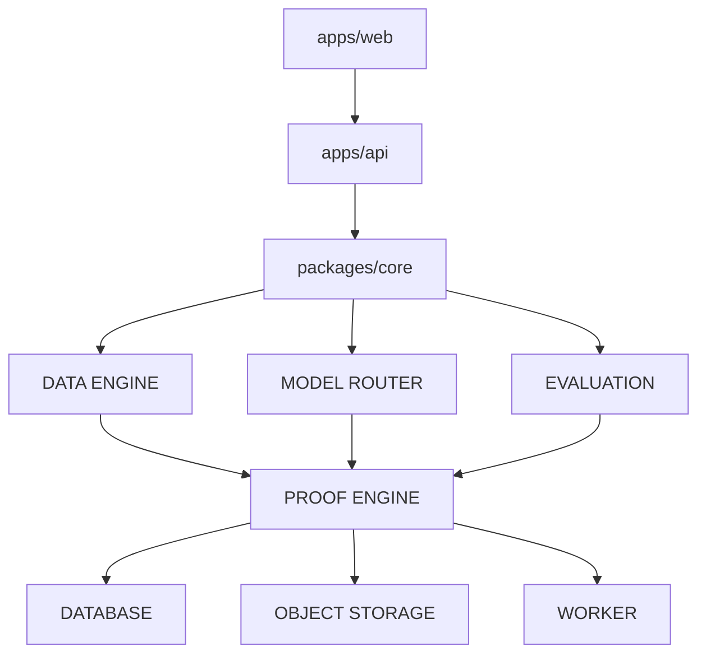

# Architecture Specification

The complete system is represented as a strict dependency graph. We do not treat features as isolated; each stage depends on the proven validation of the prior stage.

## Dependency Graph

## System Architecture

## Non-Negotiable Rules
1. The frontend must never directly access protected model infrastructure.
2. The API must enforce tenant isolation and authentication.
3. Every protected object belongs to an `organization_id` resolved from the session.
4. Causal-Safety: Future data must never leak into training or evaluation states.
5. All forecasts require a machine-readable PROOF OBJECT detailing the evidence, confidence, evaluation ID, and provenance hash.
