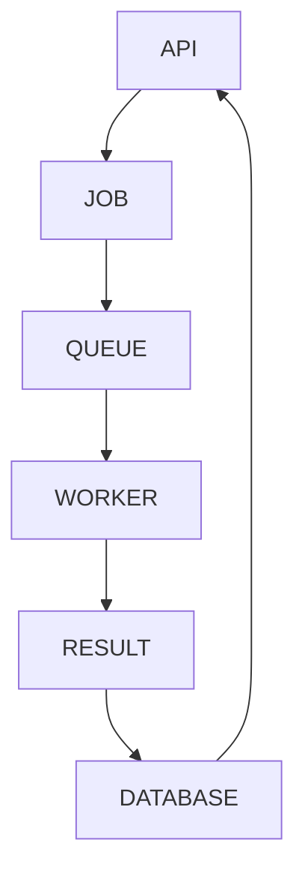

# Async Worker Architecture

## Worker Flow

```mermaid
graph TD
    A[API] --> B[JOB]
    B --> C[QUEUE]
    C --> D[WORKER]
    D --> E[RESULT]
    E --> F[DATABASE]
    F --> A
```

## Rules
- Long-running tasks MUST be processed asynchronously.
- Valid job states: QUEUED, RUNNING, SUCCEEDED, FAILED, CANCELLED.
