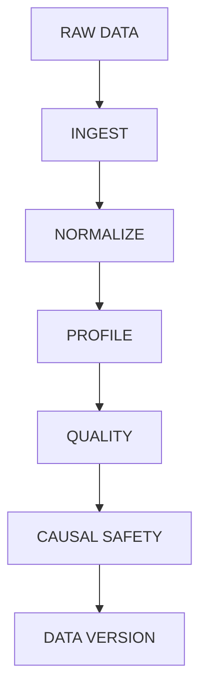

# Data Architecture

## Data Lifecycle

```mermaid
graph TD
    A[RAW DATA] --> B[INGEST]
    B --> C[NORMALIZE]
    C --> D[PROFILE]
    D --> E[QUALITY]
    E --> F[CAUSAL SAFETY]
    F --> G[DATA VERSION]
```

## Rules
- Models MUST NOT consume raw uploaded data directly.
- Causal-safety checks MUST pass before making data available for training or evaluation.
