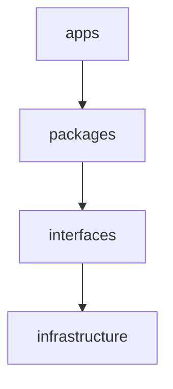

# Dependency Rules

Allowed dependency directions:

## Strict Rules
- packages MUST NOT depend on apps.
- models MUST NOT depend on frontend.
- frontend MUST NOT depend on database.
- research MUST NOT be imported into production runtime.
- MCP MUST NOT depend on database.
- billing MUST NOT depend on model internals.
- model MUST NOT depend on billing.
