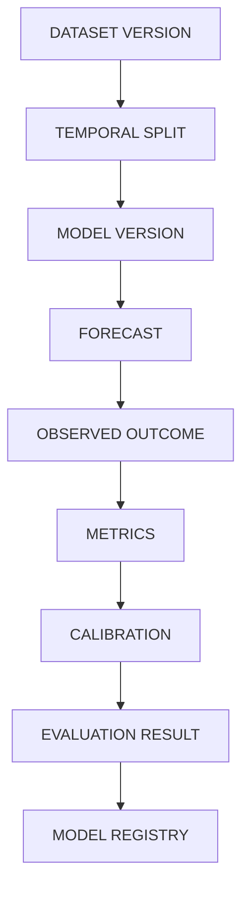
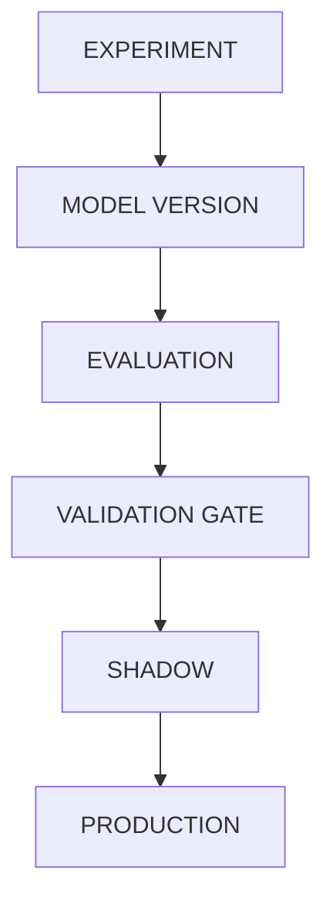

# Evaluation Architecture

## Evaluation Flow

## Model Promotion Flow

## Rules
- Evaluation MUST be independent of model implementation.
- EXPERIMENT models MUST NOT go straight to PRODUCTION without gates.
