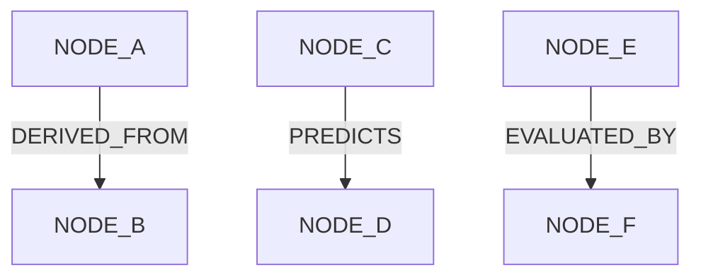

# Graph Model Architecture

## Graph Edge Abstraction

## Rules
- Graph abstractions MUST be backed by PostgreSQL for Phase 002.
- Node types MUST include: User, Organization, Project, Dataset, DatasetVersion, Feature, Model, ModelVersion, Experiment, Evaluation, Forecast, Evidence, Proof, Alert, Outcome.
- Edge types MUST be strict enums, not free-form text.
