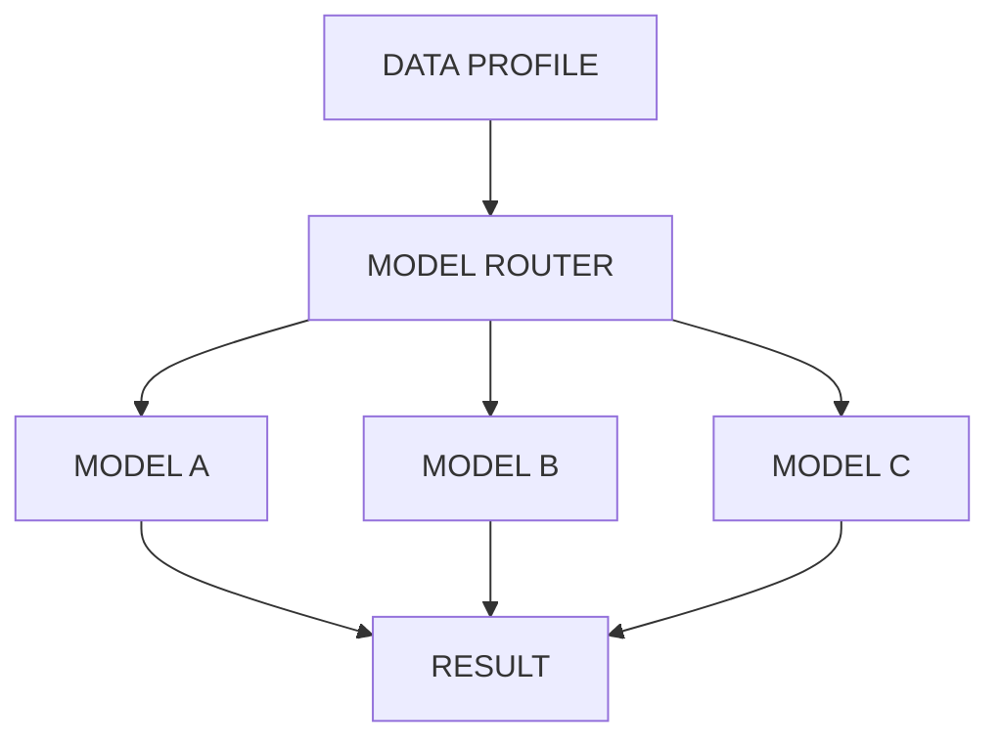

# Model Architecture

## Model Adapter and Registry

## Interface
- Models MUST implement `ModelAdapter` interface.
- Models MUST report capabilities.
- Models MUST be in one of the following states: DRAFT, EXPERIMENTAL, VALIDATED, SHADOW, PRODUCTION, DEPRECATED, RETIRED.
- EXPERIMENTAL models MUST NOT be selected by automated production routing.
