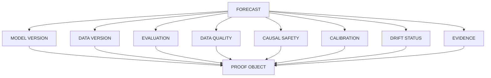

# Proof Architecture

## Forecast and Proof Flow

```mermaid
graph TD
    A[FORECAST] --> B[MODEL VERSION]
    A --> C[DATA VERSION]
    A --> D[EVALUATION]
    A --> E[DATA QUALITY]
    A --> F[CAUSAL SAFETY]
    A --> G[CALIBRATION]
    A --> H[DRIFT STATUS]
    A --> I[EVIDENCE]
    B & C & D & E & F & G & H & I --> J[PROOF OBJECT]
```

## Rules
- Every production forecast MUST generate a PROOF OBJECT.
- Proofs MUST contain provenance_hash and evidence arrays.
