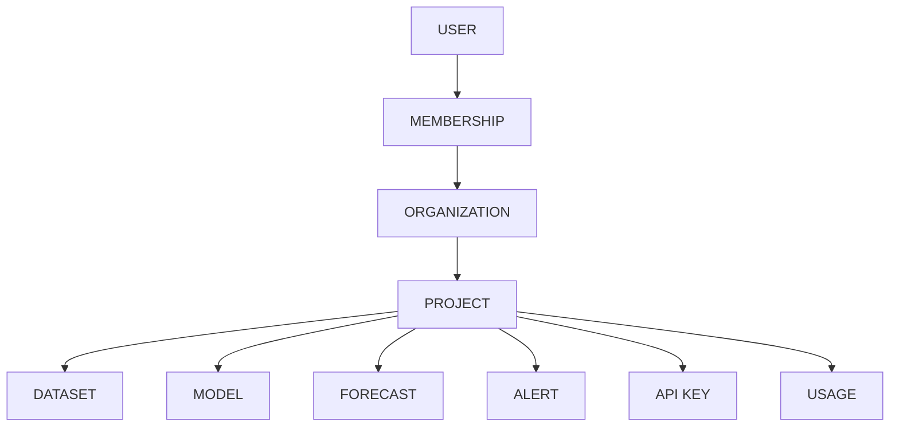
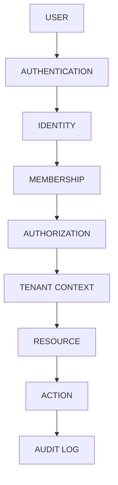

# Security Architecture

## Tenant Graph

## Security Flow

## Rules
- Tenant context MUST be resolved securely, never trusted from client payload.
- Permissions MUST be categorized (e.g. PROJECT_READ, DATASET_WRITE).
